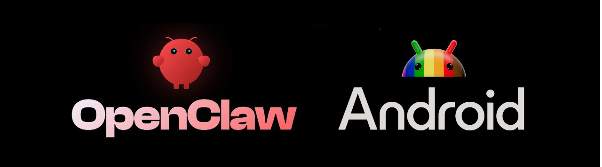
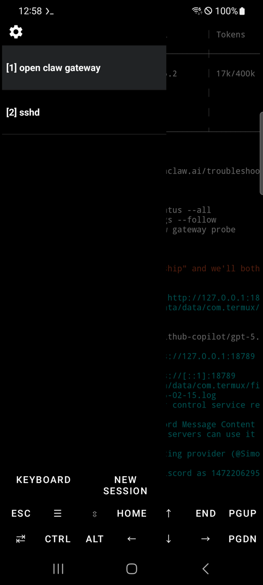
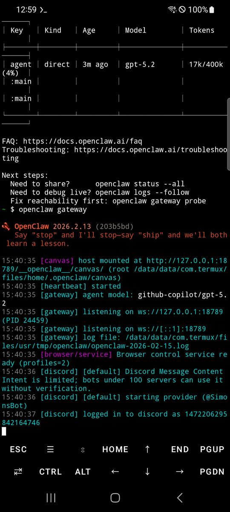
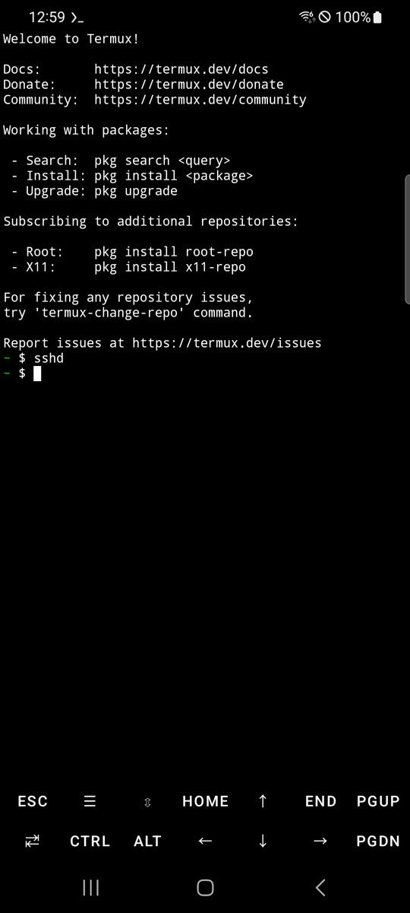

# OpenClaw on Android



Because Android deserves a shell.

## Why?

An Android phone is a great environment for running an OpenClaw server:

- **Sufficient performance** — Even models from a few years ago have more than enough specs to run OpenClaw
- **Repurpose old phones** — Put that phone sitting in your drawer to good use. No need to buy a mini PC
- **Low power + built-in UPS** — Runs 24/7 on a fraction of the power a PC would consume, and the battery keeps it alive through power outages
- **No personal data at risk** — Install OpenClaw on a factory-reset phone with no accounts logged in, and there's zero personal data on the device. Dedicating a PC to this feels wasteful — a spare phone is perfect

## No Linux install required

The standard approach to running OpenClaw on Android requires installing proot-distro with Ubuntu, adding 700MB-1GB of overhead. OpenClaw on Android eliminates this by patching compatibility issues directly, letting you run OpenClaw in pure Termux.

| | Standard (proot-distro) | This project |
|---|---|---|
| Storage overhead | 700MB - 1GB | ~50MB |
| Setup time | 10-15 min | 3-5 min |
| Performance | Slower (proot layer) | Native speed |
| Complexity | High | One command |

## Requirements

- Android 7.0 or higher
- ~500MB free storage
- Wi-Fi or mobile data connection

## Step-by-Step Setup (from a fresh phone)

### Step 1: Enable Developer Options and Stay Awake

OpenClaw runs as a server, so the screen turning off can cause Android to throttle or kill the process. Keeping the screen on while charging ensures stable operation.

**A. Enable Developer Options**

1. Go to **Settings** > **About phone** (or **Device information**)
2. Tap **Build number** 7 times
3. You'll see "Developer mode has been enabled"
4. Enter your lock screen password if prompted

> On some devices, Build number is under **Settings** > **About phone** > **Software information**.

**B. Stay Awake While Charging**

1. Go to **Settings** > **Developer options** (the menu you just enabled)
2. Turn on **Stay awake**
3. The screen will now stay on whenever the device is charging (USB or wireless)

> The screen will still turn off normally when unplugged. Keep the charger connected when running the server for extended periods.

**C. Set Charge Limit (Required)**

Keeping a phone plugged in 24/7 at 100% can cause battery swelling. Limiting the maximum charge to 80% greatly improves battery lifespan and safety.

- **Samsung**: **Settings** > **Battery** > **Battery Protection** → Select **Maximum 80%**
- **Google Pixel**: **Settings** > **Battery** > **Battery Protection** → ON

> Menu names vary by manufacturer. Search for "battery protection" or "charge limit" in your settings. If your device doesn't have this feature, consider managing the charger manually or using a smart plug.

### Step 2: Install Termux

> **Important**: The Play Store version of Termux is discontinued and will not work. You must install from F-Droid.

1. Open your phone's browser and go to [f-droid.org](https://f-droid.org)
2. Search for `Termux`, then tap **Download APK** to download and install
   - Allow "Install from unknown sources" when prompted

### Step 3: Initial Termux Setup and Background Kill Prevention

Open the Termux app and paste the following command. It updates repos, installs curl, and enables background kill prevention — all in one go.

```bash
pkg update -y && pkg upgrade -y && pkg install -y curl && termux-wake-lock
```

> You may be asked to choose a mirror on first run. Pick any — a geographically closer mirror will be faster.

Once `termux-wake-lock` runs, a notification pins in the status bar and prevents Android from killing the Termux process. To release it later, run `termux-wake-unlock` or swipe the notification away.

**Disable Battery Optimization for Termux**

1. Go to Android **Settings** > **Battery** (or **Battery and device care**)
2. Open **Battery optimization** (or **App power management**)
3. Find **Termux** and set it to **Not optimized** (or **Unrestricted**)

> The exact menu path varies by manufacturer (Samsung, LG, etc.) and Android version. Search your settings for "battery optimization" to find it.

### Step 4: Install OpenClaw

Once Step 3 finishes, paste the following command.

(Typing commands is much easier via SSH from a computer. See the [Termux SSH Setup Guide](docs/termux-ssh-guide.md) for details.)

```bash
curl -sL https://raw.githubusercontent.com/AidanPark/openclaw-android/main/bootstrap.sh | bash && source ~/.bashrc
```

The installer automatically handles the following 7 steps. This takes 3–10 minutes depending on network speed and device. Wi-Fi is recommended.

```
install.sh (entry point)
  ├── [1/7] scripts/check-env.sh      # Verify Termux environment
  ├── [2/7] scripts/install-deps.sh    # pkg install (nodejs-lts, etc.)
  ├── [3/7] scripts/setup-paths.sh     # Create directories
  ├── [4/7] scripts/setup-env.sh       # Add env vars to .bashrc
  ├── [5/7] patches/apply-patches.sh   # Install OpenClaw & apply patches
  │         ├── bionic-compat.js copy
  │         └── patches/patch-paths.sh # sed hardcoded path replacements
  ├── [6/7] tests/verify-install.sh    # Verify installation
  └── [7/7] openclaw update            # Update to latest version
```

Once complete, the OpenClaw version is displayed along with instructions to run `openclaw onboard`.

### Step 5: Start OpenClaw Setup

As instructed in the installation output, run:

```bash
openclaw onboard
```

Follow the on-screen instructions to complete the initial setup.


### Step 6: Start the Gateway and Set Up Termux Tabs

Once setup is complete, start the gateway. Running it directly on the phone's Termux is the most stable approach.

```bash
openclaw gateway
```

To keep the gateway running while doing other work, use Termux's **tab** feature. Swipe from left to right on the bottom of the screen to open the tab menu. Tap **NEW SESSION** to add a new tab.



Recommended tab setup:

- **Tab 1**: `openclaw gateway` — Monitor gateway status in real time



- **Tab 2**: `sshd` — Allow SSH access from your computer ([SSH Setup Guide](docs/termux-ssh-guide.md))



With these two tabs open, the gateway runs stably while you can SSH in from your computer for additional tasks.

> To stop the gateway, press `Ctrl+C` in Tab 1. Do not use `Ctrl+Z` — it only suspends the process without terminating it. Always use `Ctrl+C`.

## What It Does

The installer automatically resolves the differences between Termux and standard Linux. There's nothing you need to do manually — the single install command handles all 5 of these:

1. **Platform recognition** — Configures Android to be recognized as Linux
2. **Network error prevention** — Automatically works around network-related crashes on Android
3. **Path conversion** — Automatically converts standard Linux paths to Termux paths
4. **Temp folder setup** — Automatically configures an accessible temp folder for Android
5. **Service manager bypass** — Configures normal operation without systemd

## Performance

CLI commands like `openclaw status` may feel slower than on a PC. This is because each command needs to read many files, and the phone's storage is slower than a PC's, with Android's security processing adding overhead.

However, **once the gateway is running, there's no difference**. The process stays in memory so files don't need to be re-read, and AI responses are processed on external servers — the same speed as on a PC.

<details>
<summary>Technical Documentation for Developers</summary>

## Project Structure

```
openclaw-android/
├── bootstrap.sh                # curl | bash one-liner installer (downloader)
├── install.sh                  # One-click installer (entry point)
├── uninstall.sh                # Clean removal
├── patches/
│   ├── bionic-compat.js        # Platform override + os.networkInterfaces() safe wrapper
│   ├── patch-paths.sh          # Fix hardcoded paths in OpenClaw
│   └── apply-patches.sh        # Patch orchestrator
├── scripts/
│   ├── check-env.sh            # Pre-flight environment check
│   ├── install-deps.sh         # Install Termux packages
│   ├── setup-env.sh            # Configure environment variables
│   └── setup-paths.sh          # Create directories and symlinks
├── tests/
│   └── verify-install.sh       # Post-install verification
└── docs/
    ├── termux-ssh-guide.md     # Termux SSH setup guide (EN)
    ├── termux-ssh-guide.ko.md  # Termux SSH setup guide (KO)
    ├── troubleshooting.md      # Troubleshooting guide (EN)
    ├── troubleshooting.ko.md   # Troubleshooting guide (KO)
    └── images/                 # Screenshots and images
```

## Detailed Installation Flow

Running `bash install.sh` executes the following 7 steps in order.

### [1/7] Environment Check — `scripts/check-env.sh`

Validates that the current environment is suitable before starting installation.

- **Termux detection**: Checks for the `$PREFIX` environment variable. Exits immediately if not in Termux
- **Architecture check**: Runs `uname -m` to verify CPU architecture (aarch64 recommended, armv7l supported, x86_64 treated as emulator)
- **Disk space**: Ensures at least 500MB free on the `$PREFIX` partition. Errors if insufficient
- **Existing installation**: If `openclaw` command already exists, shows current version and notes this is a reinstall/upgrade
- **Node.js pre-check**: If Node.js is already installed, shows version and warns if below 22

### [2/7] Package Installation — `scripts/install-deps.sh`

Installs Termux packages required for building and running OpenClaw.

- Runs `pkg update -y` to refresh package repos
- Installs the following packages:

| Package | Role | Why It's Needed |
|---------|------|-----------------|
| `nodejs-lts` | Node.js LTS runtime (>= 22) + npm package manager | OpenClaw is a Node.js application. Node.js and npm are required to install it via `npm install -g openclaw`. LTS is used because OpenClaw requires Node >= 22.12.0 |
| `git` | Distributed version control | Some npm packages have git dependencies. Sub-dependencies of OpenClaw may reference packages via git URLs. Also needed if installing this repo via `git clone` |
| `python` | Python interpreter | Used by `node-gyp` to run build scripts when compiling native C/C++ addons. Required when OpenClaw's dependency tree includes native modules (e.g., `better-sqlite3`, `bcrypt`) |
| `make` | Build automation tool | Executes Makefiles generated by `node-gyp` to compile native modules. Core part of the native build pipeline alongside `python` |
| `cmake` | Cross-platform build system | Some native modules use CMake-based builds instead of Makefiles. Cryptography-related libraries (`argon2`, etc.) often include CMakeLists.txt |
| `clang` | C/C++ compiler | Default C/C++ compiler in Termux. Used by `node-gyp` to compile C/C++ source of native modules. Termux uses Clang as standard instead of GCC |
| `tmux` | Terminal multiplexer | Allows running the OpenClaw server in a background session. In Termux, apps going to background may suspend processes, so running inside a tmux session keeps it stable |

- After installation, verifies Node.js >= 22 and npm presence. Exits on failure

### [3/7] Path Setup — `scripts/setup-paths.sh`

Creates the directory structure needed for Termux.

- `$PREFIX/tmp/openclaw` — OpenClaw temp directory (replaces `/tmp`)
- `$HOME/.openclaw-android/patches` — Patch file storage location
- `$HOME/.openclaw` — OpenClaw data directory
- Displays how standard Linux paths (`/bin/sh`, `/usr/bin/env`, `/tmp`) map to Termux's `$PREFIX` subdirectories

### [4/7] Environment Variables — `scripts/setup-env.sh`

Adds an environment variable block to `~/.bashrc`.

- Wraps the block with `# >>> OpenClaw on Android >>>` / `# <<< OpenClaw on Android <<<` markers for management
- If the block already exists, removes the old one and adds a fresh one (prevents duplicates)
- Environment variables set:
  - `TMPDIR=$PREFIX/tmp` — Use Termux temp directory instead of `/tmp`
  - `TMP`, `TEMP` — Same as `TMPDIR` (for compatibility with some tools)
  - `NODE_OPTIONS="-r .../bionic-compat.js"` — Auto-load Bionic compatibility patch for all Node processes
  - `CONTAINER=1` — Bypass systemd existence checks

### [5/7] OpenClaw Installation & Patching — `npm install` + `patches/apply-patches.sh`

Installs OpenClaw globally and applies Termux compatibility patches.

1. Copies `bionic-compat.js` to `~/.openclaw-android/patches/` (needed during npm install as well)
2. Runs `npm install -g openclaw@latest`
3. `patches/apply-patches.sh` applies all patches:
   - Verifies `bionic-compat.js` final copy
   - Runs `patches/patch-paths.sh` — uses sed to replace hardcoded paths in installed OpenClaw JS files:
     - `"/tmp"` / `'/tmp'` → `"$PREFIX/tmp"` / `'$PREFIX/tmp'`
     - `"/bin/sh"` → `"$PREFIX/bin/sh"`
     - `"/bin/bash"` → `"$PREFIX/bin/bash"`
     - `"/usr/bin/env"` → `"$PREFIX/bin/env"`
   - Logs patch results to `~/.openclaw-android/patch.log`

### [6/7] Installation Verification — `tests/verify-install.sh`

Checks 7 items to confirm installation completed successfully.

| Check Item | PASS Condition |
|------------|---------------|
| Node.js version | `node -v` >= 22 |
| npm | `npm` command exists |
| openclaw | `openclaw --version` succeeds |
| TMPDIR | Environment variable is set |
| NODE_OPTIONS | Environment variable is set |
| CONTAINER | Set to `1` |
| bionic-compat.js | File exists in `~/.openclaw-android/patches/` |
| Directories | `~/.openclaw-android`, `~/.openclaw`, `$PREFIX/tmp` exist |
| .bashrc | Contains environment variable block |

All items pass → PASSED. Any failure → FAILED with reinstall instructions.

### [7/7] OpenClaw Update

Runs `openclaw update` to ensure the latest version. On completion, displays the OpenClaw version and instructs the user to run `openclaw onboard` to start setup.

</details>

## Uninstall

```bash
bash ~/.openclaw-android/uninstall.sh
```

This removes the OpenClaw package, patches, environment variables, and temp files. Your OpenClaw data (`~/.openclaw`) is optionally preserved.

## Troubleshooting

See the [Troubleshooting Guide](docs/troubleshooting.md) for detailed solutions.

## License

MIT
